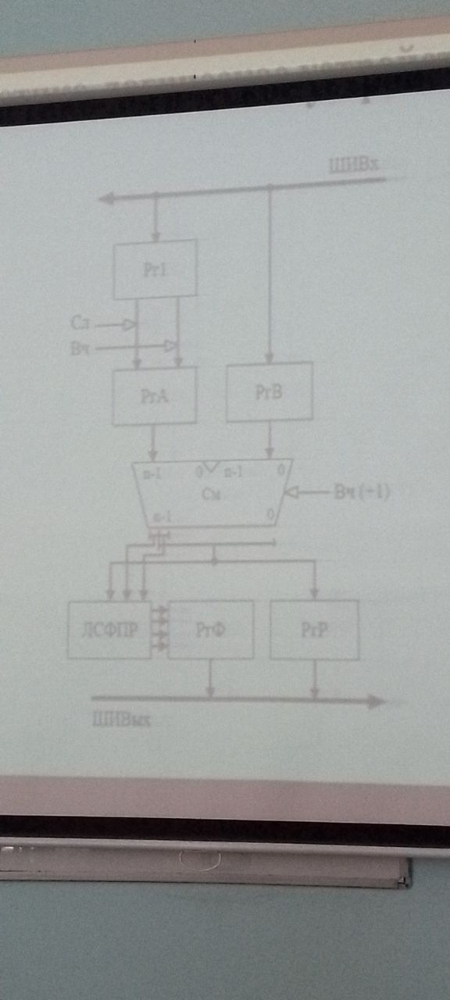

### Структура аппаратных (технических) средств ЭВМ

Состав устройств компьютера и порядок их взаимодействия

Упрощенная схема:

Устройство обмена (УО) ко всем подключается через контроллеры (К):
- УУ
  - РгП
  - АЛУ
- Основная память (ОП)
- Внешняя память (ВП)
- Периферийные устройства (ПУ)
- Устройства вывода (УВыв)
- Устройства ввода (УВв)

Группы:
- Центральный процессор (ЦП)
  - Регистровая память (РГП)
  - устройство управления (УУ)
  - Арифметико-логическое устройство (АЛУ)

Решение задачи пользователя:
1. Загрузка требуемой информации в ЭВМ
   - Для этого используются устройства ввода (УВв)
   - Это стандартные устройства: клавиатура, мышь
   - Также может поступать через
     специализированные периферийные устройства (ПУ)
     - Голосовой ввод
     - Графический ввод
     - Датчики
     - ...
2. Информация передается на устройство обмена (УО)
   - Оно служит для взаимодействия других устройств
   - В качестве УО выступают различные шины
   - Обычно устройства напрямую не могут подключаться к УО
   - Для этого используются контроллеры сопряжения (К)
3. Информация из устройств обмена передается в основную память (ОП)
4. Если информация не требует немедленной обработке,
   она выгружается во внешнюю память (ВП)
   - И может там храниться сколь угодно долго
5. Если информацию требуется немедленно обработать,
   она поступает в центральный процессор (ЦП)
   - Внутри ЦП обработка выполняется при помощи АЛУ
     (арифметико-логического устройства)
   - Ходом вычислительного процесса и другими устройствами
     управляет УУ - устройство управления
   - Обычно электрические схемы ЦП работают значительно
     быстрее чем ОП
     - Поэтому если требуется часто подгружать данные
       из ОП, процессор будет простаивать
     - Чтобы уменьшить время простоев, было решено размесить
       на кристалле процессора _сверхоперативную_ память небольшого объема.
     - Такая память называется регистровой (РгП)
6. После обработки информация выгружается в ОП или ВП,
   откуда уходит на устройства вывода (УВыв), либо на ПУ

> Центральный процессор и основная память образуют _ядро ЭВМ_,
> остальные устройства считаются "внешними"

> Описанная структура соответствует классической
> Пристонской (фон-Неймановской) архитектуре

> [!NOTE]
> 
> это было в прошлом семестре

### Функциональная и структурная организация ЦП

Процессор - это устройство, осуществляющее обработку данных и управляющее ходом вычислительного процесса

В ЭВМ может быть сразу несколько процессоров, и они могут отличаться по функциональному назначению

Можно выделить процессоры:
- Арифметические
- Графические
- Сетевые
- Буферные
- Контроллеры ввода/вывода
- ...

В ЭВМ всегда должен быть главный обрабатывающий процессор (ЦП)

Этот процессор, помимо обработки данных, отвечает за выполнение программ,
управляет работой периферийных устройств и реагирует на запросы из
внешней среды

Типичная последовательность работы ЦП:
- Программа загружается в ОП
- Адрес ее первой команды передается процессору
- Процессор формирует запрос к ОП, чтобы считать код команды по данному адресу
- Получив код команды, процессор начинает его анализировать
  - Выделяются код операции и адреса операндов
  - Код операции дешифруется для настройки всех устройств процессора,
    требуемых выполняющих данную операцию
- По адресам операндов выполняются обращения к ОП для получения их значений
- Когда значения операндов получены, происходит выполнение операции
- Результат выполнения операции загружается в ОП по требуемому адресу
- Процессору необходимо сформировать адрес следующей команды

Для реализации описанных функций в процессоре обязательно имеется
- АЛУ
  - Выполняет все арифметические и логические операции
  - Формирует служебные сигналы
- УУ
  - Вырабатывает управляющие сигналы, необходимые для функционирования процессора
  - Кроме того, формирует адрес следующей инструкции в программе
- РгП
  - Служит для временного хранения операндов, результатов операций
  и состояния процессора
  - Имеет небольшой объем, но высокую скорость
- Внутренние шины
  - Предназначены для обмена данными, адресами и управляющими сигналами между устройствами процессора

В составе процессора может быть одно универсальное АЛУ для всех операций
или несколько для реализации определенных.

Функциональные возможности ЦП могут дополняться внешними специализированными процессорами

- Сопроцессоры
  - Применяются для эффективного выполнения операций над определенными видами данных (напр. float)
- Акселераторы
  - Применяются для быстрой обработки специальных данных (напр. графики - ГПУ)
- Контроллеры
  - Предназначены для взаимодействия с внешними устройствами

#### Устройство АЛУ

По способу действия АЛУ делятся на
- Последовательные
  - В них операнды обрабатываются один за другим (поразрядно), начиная с младших разрядов
- Параллельные
  - Все разряды обрабатываются одновременно
  - Работают быстрее

Часто в АЛУ имеется возможность повышения разрядности

При этом операнды делятся на части, которые обрабатываются последовательно

Работа большинства АЛУ построена на одной элементарной операции - сложение двух чисел

Рассмотрим в качестве примера АЛУ, выполняющее данную операцию.

АЛУ также будет позволять выполнять вычитание за счет преобразования
одного операнда в дополнительный код (two's complement)

Центральным элементом такого АЛУ будет являться сумматор

Также обязательно использовать регистры для временного хранения операндов
и результата

---

АЛУ состоит из:
- Параллельного сумматора (См)
- Регистра результата (РгР)
- Регистров операндов (РгA, РгB)
- Входного буферного регистра (Рг1)
- Логической схемы формирования признаков результата (ЛСФПР)
- Регистр флагов (РгФ) (условно)

Операнды поступают в АЛУ с входной шины (ШиВх)

Первое слагаемое (при вычитании - уменьшаемое) загружается в РгB

Второе слагаемое (вычитаемое) загружается в Рг1

Если выполняется сложение - значение передается в РгА из Рг1 без изменений

Если вычитание - все разряды инвертируются

Таким образом получим в РгА обратный код числа с противоположным знаком

Для получения дополнительного кода при вычитании к младшему разряду сумматора прибавляется 1

Полученный результат из РгР выгружается на ШиВых (выходную информационную шину)

<!-- Некоторые результаты должны сопровождаться специальными сигналами -->

Некоторые результаты должны отмечаться определенными служебными сигналами, изменяющими регистр флагов процессора

Данные признаки могут понадобится для реализации команд ассемблера

Чаще всего признаком отмечается
- Нулевой результат (ZF)
- Отрицательный результат (SF)
- Перенос из старшего разряда (CF)
- Переполнение (OF)

Для формирования этих сигналов используется ЛСФПР, которая анализирует
все разряды результата, его знаковый разряд, а также старший <!-- последний --> цифровой
разряд

Полученные сигналы устанавливают флаги в РгФ

На основании данного АЛУ могут строиться более сложные АЛУ

Для реализации операций умножения и деления потребуется использовать сдвиговые регистры
