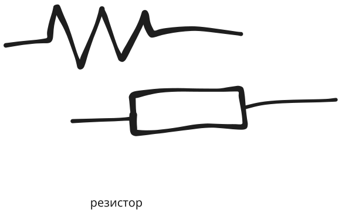

# Резистор

Это такой электронный компонент, который предназначен
для контролируемого изменения сопротивления электрических цепей

Резисторы могут быть постоянными и переменными

у переменных можно менять сопротивление

По конструкции различают резисторы:
- Пленочные
- Объемные
- Проволочные

Также резисторы отличаются по материалу изготовления; бывают:
- Углеродистые
- Металлопленочные
- Металлооксидные
- Композитные
- И даже полупроводниковые

На схемах резисторы обозначаются прямоугольником или пилообразной фигурой

буквой R

---

Главная характеристика резистора - это номинальное сопротивление

<!-- Номинальное - значит что у м -->
Номинальное сопротивление указывается в документации и является идеальным значением

<!-- фактическое сопротивление немного отличается -->
Реальное, фактическое сопротивление может немного отличаться

Выраженное в процентах отклонение фактического значения сопротивления от номинального называется допуском

Допуск определяет класс точности резистора
- 1 класс: +- 5%
- 2 класс: +- 10%
- 3 класс: +- 20%

---

Следующая важная характеристика - номинальная мощность рассеивания

Это максимально возможная тепловая энергия, которая может быть
рассеяна на резисторе при сохранении его целостности и основных параметров
в течение длительного времени

Данная характеристика связана с величиной тока, протекающего через резистор

Зависимость выделяемой теплоты от протекаемого тока вычисляется по закону
Джоуля-Ленца

$P = I^2 R$

(P - мощность)

$P = I U$

Номинальная мощность зависит от площади резистора и его материала

Если фактическая мощность превышает номинальную, то резистор может разрушиться (перегореть)

Типовые мощности для большинства резисторов: от 0,01 Вт до 100 Вт

---

Температурный коэффицент сопротивления (ТКС)

Этот параметр характеризует относительное изменение сопротивления резистора
при изменении температуры окружающей среды на $1 \degree C$

<!-- данный параметр может быть как вредным -->

---

## Маркировка резистора

100 (100R) - 100 Ом

100К - 100 кОм

100М - 100 МОм

К100

В настоящее время чаще применяется цветовая маркировка резисторов,
которая представляет собой "круговые" полосы (кольца) на поверхности резистора

Обычно используются 4 или 5 полос

Первая полоса - это первая цифра в значении сопротивления

также со второй и третьей

третьей цифры может не быть

Следующая полоса - множитель

Последняя полоса это допуск

<!-- При помощи перви -->

Сопротивление выражается 2-3 цифрами в омах (последняя не равна нулю)
